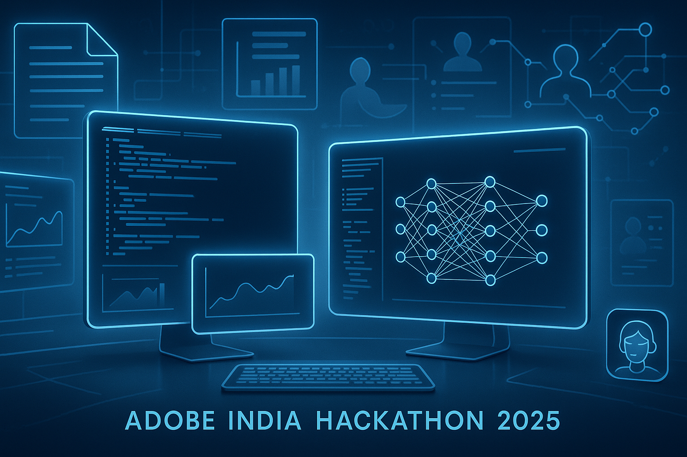

# Adobe India Hackathon 2025 🧠🚀

This repository contains solutions for **Adobe India Hackathon 2025**, developed by [Akshat Palia](https://github.com/Akshat-palia). The project is divided into two major challenges, each focusing on document intelligence, information extraction, and persona-driven summarization.

---

## 📁 Repository Structure

Adobe-India-Hackathon-2025/
│
├── challenge_1a/ # Structured Outline Extraction from PDFs
│ └── README.md
│
├── challenge_1b/ # Persona-Based Document Intelligence System
│ └── README.md
│
└── README.md

---

## ✅ Challenge 1a — Structured Outline Extraction

> Extract hierarchical outlines from academic and business PDFs using lightweight, open-source tools under tight runtime and memory constraints.

- Input: Single PDF (up to 50 pages)
- Output: JSON with title and outline (headings, levels, page numbers)
- Constraints: ≤10s, CPU-only, ≤200MB model

📍 More in [`challenge_1a/README.md`](challenge_1a/README.md)

---

## ✅ Challenge 1b — Persona-Based Document Intelligence

> Build an intelligent system that extracts and prioritizes information from multiple documents tailored to a user persona and job-to-be-done.

- Input: Collection of PDFs + persona
- Output: Metadata, extracted sections, sub-section analysis (ranked)
- Constraints: ≤60s, CPU-only, ≤1GB model

📍 More in [`challenge_1b/README.md`](challenge_1b/README.md)

---

## 📌 Tech Stack

- Python 3
- PyMuPDF / pdfplumber
- Scikit-learn, Sentence Transformers
- Open-source NLP/LLM tools
- Docker-compatible, no internet dependency

---

## 📫 Contact

For queries or collaboration:
**Akshat Palia** – [@Akshat-palia](https://github.com/Akshat-palia)

---

> ⚡ Built with precision, under constraints, for impact.
